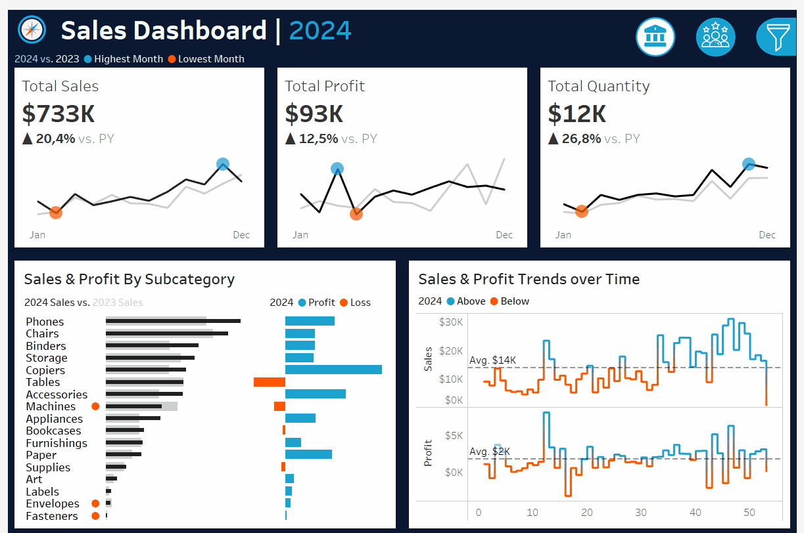

<a id="top"></a>

<details>
  <summary>🇬🇧 Read In English (Click to open)</summary>
  <br>
  
# 📠 Sales & Customer Performance Analysis

## 🚀 Project Summary

This project showcases an **End-to-End Data Analytics** workflow, focusing on transforming raw sales and customer data into an actionable **Business Intelligence (BI)** report. The analysis presents an overview of sales metrics and trends, including a **Year-over-Year (YoY)** comparison against the previous year's (PY) performance.

**✨ For the complete case study, final visualizations, and in-depth explanations, please visit [My Notion Portfolio](https://www.notion.so/Sales-Customer-Analysis-Performance-Dashboard-Project-1e26e9f3bfd6815cad0fdf8a0648d1f2?source=copy_link).**

---

## 📌 Problem Statement

Currently, core business data is often fragmented across separate systems (sales transactions, customer records, inventory), making it challenging for management to unify financial performance with customer behavior.

Based on the dashboard screens, the key problems solved are:

- **Fragmented Performance Monitoring** → Traditional reporting separates sales figures from customer activity, making it impossible to see the combined health of the business.
- **Inability to Quantify Growth Drivers** → It is difficult to immediately quantify Year-over-Year (YoY) growth in **Sales (20.4%), Profit (12.5%),** and **Total Customers (8.6%)** to assess true business momentum.
- **Lack of Profitability Clarity** → Without a unified view, the business cannot easily pinpoint which product categories **(Subcategories)** are high-profit contributors (e.g., Phones) and which are leading to significant financial Loss **(e.g., Tables)**.
- **Unstructured Customer Loyalty Analysis** → The business struggles to identify loyal customers and segment its base effectively. The dashboard immediately shows the concentration of customers with low order counts (200 customers with 1-2 orders), and highlights high-value clients (e.g., **Raymond Buch** as the top profit generator).
- **Delayed Trend Detection** → Weekly or daily sales fluctuations are hard to track. The **Sales & Profit Trends over Time** chart enables operations to quickly spot performance anomalies (Above/Below Average) and react in real-time.
- **Untargeted Decision-Making** → Management lacked data to implement focused strategies. The consolidated view now allows for data-driven decisions on optimizing inventory (reducing loss-making products) and implementing targeted loyalty programs for the **Top 10 Customers by Profit**.

---

## 🛠️ Tech Stack & Tools

* **Visualization & Analysis:** **Tableau Public**
* **Calculations & Metrics:** **Calculated Fields**
* **Data Source:** **CSV**

---

## 📂 Repository Structure
```
Sales-Customer-Analysis-Performance-Dashboard-Project/ 
├── README.md                           # Main explanation for this project 
│ 
├── datasets/                           # Contains the raw sample data used 
│ 
├── calculated fields/                  # Contains .txt files with the main Calculated Fields formulas 
│   ├── Sales_Metrics.txt 
│   └── Customer_Metrics.txt 
│ 
├── docs/                               # Contains all documentation & screenshots 
│   ├── Sales_Dashboard.png 
│   ├── Customer_Dashboard.png 
│   └── Dashboard_Interaction.gif
│
└── tableau/                            # Contains files related to the Tableau visualization
    └── Sales & Customer Dashboard.twbx
```
---

## 📊 Dashboard Visualizations
Here is a preview of the main dashboard that has been developed:

### Sales Dashboard
*Focuses on sales performance, product profitability, and trends over time.*


### Customer Dashboard
*Focuses on customer segmentation, VIP customer identification, and loyalty analysis.*


## 🙍 About Me

Hello, I'm **Ahmad Zaki Amani** 👋

✨ I have a strong interest in the fields of **Data Analytics** and **Business Intelligence**, especially in building dashboards, creating data visualizations, and turning raw data into meaningful insights.

💡 This project is part of my portfolio, showcasing skills in:

* Data visualization & storytelling
* Dashboard design (Power BI, Tableau)
* Data transformation & analysis
* Business Intelligence solutions

📫 Let's connect and collaborate!

[](mailto:ahmadzaki27.az@gmail.com)
[](https://www.linkedin.com/in/ahmad-zaki-amani-ab091635b/)
[](https://www.notion.so/Portofolio-Data-Analysis-1e26e9f3bfd680fb9c92f7dc6734a391?source=copy_link)
---

<p align="right"><a href="#top">Back To Top ⬆️</a></p>  
</details>

---

</details>

<details>
  <summary>🇮🇩 Baca dalam Bahasa Indonesia (Klik untuk membuka)</summary>
  <br>

# 📠 Analisis Kinerja Penjualan & Pelanggan

## 🚀 Ringkasan Proyek

Proyek ini menampilkan alur kerja **End-to-End Data Analytics**, yang berfokus pada transformasi data penjualan dan pelanggan mentah menjadi laporan **Business Intelligence (BI)** yang dapat ditindaklanjuti. Analisis ini menyajikan gambaran metrik penjualan serta tren, termasuk perbandingan **Year-over-Year (YoY)** terhadap kinerja tahun sebelumnya (PY).

**✨ Untuk studi kasus lengkap, visualisasi akhir, dan penjelasan mendalam, silakan kunjungi [Portofolio Notion Saya](https://www.notion.so/Sales-Customer-Analysis-Performance-Dashboard-Project-1e26e9f3bfd6815cad0fdf8a0648d1f2?source=copy_link).**

---

## 📌 Permasalahan

Saat ini, data inti bisnis sering tersebar di berbagai sistem (transaksi penjualan, data pelanggan, persediaan), sehingga sulit bagi manajemen untuk menghubungkan kinerja keuangan dengan perilaku pelanggan.

Berdasarkan tampilan dashboard, masalah utama yang dipecahkan adalah:

* **Pemantauan Kinerja yang Terfragmentasi** → Laporan tradisional memisahkan angka penjualan dari aktivitas pelanggan, sehingga sulit melihat kesehatan bisnis secara menyeluruh.
* **Sulit Mengukur Pendorong Pertumbuhan** → Sulit mengukur pertumbuhan YoY pada **Penjualan (20,4%), Laba (12,5%)**, dan **Total Pelanggan (8,6%)** untuk menilai momentum bisnis.
* **Kurangnya Kejelasan Profitabilitas** → Tanpa pandangan menyeluruh, sulit mengidentifikasi subkategori produk yang menyumbang laba tinggi (misalnya **Phones**) dan produk yang merugikan (misalnya **Tables**).
* **Analisis Loyalitas Pelanggan yang Tidak Terstruktur** → Bisnis kesulitan mengidentifikasi pelanggan loyal dan melakukan segmentasi. Dashboard langsung menampilkan konsentrasi pelanggan dengan sedikit pesanan (200 pelanggan hanya 1–2 pesanan), sekaligus menyoroti pelanggan bernilai tinggi (misalnya **Raymond Buch** sebagai penyumbang laba terbesar).
* **Keterlambatan Deteksi Tren** → Fluktuasi mingguan/harian sulit dilacak. Grafik **Tren Penjualan & Laba dari Waktu ke Waktu** membantu mendeteksi anomali (di atas/bawah rata-rata) secara cepat dan responsif.
* **Keputusan yang Kurang Terarah** → Manajemen sebelumnya tidak memiliki data yang cukup untuk strategi fokus. Dengan tampilan terintegrasi, kini keputusan dapat berbasis data: optimasi stok (mengurangi produk merugi) dan program loyalitas pelanggan (Top 10 Customers by Profit).

---

## 🛠️ Tech Stack & Tools

* **Visualisasi & Analisis:** **Tableau Public**
* **Kalkulasi & Metrik:** **Calculated Fields**
* **Sumber Data:** CSV

---

## 📂 Struktur Repository
```
Sales-Customer-Analysis-Performance-Dashboard-Project/ 
├── README.md                             # Penjelasan utama proyek ini 
│ 
├── datasets/                             # Berisi sampel data mentah yang digunakan 
│ 
├── calculated fields/                    # Berisi file .txt dengan rumus Calculated Fields utama 
│   ├── Sales_Metrics.txt 
|   └── Customer_Metrics.txt 
│ 
├── docs/                                 # Berisi semua dokumentasi & screenshot 
│   ├── Sales_Dashboard.png 
│   ├── Customer_Dashboard.png 
│   └── Dashboard_Interaction.gif
|
└── tableau/                               # Contains files related to the Tableau visualization
     └── Sales & Customer Dasahboard.twbx 
```

---
## 📊 Visualisasi Dasbor
Berikut adalah cuplikan dari dasbor utama yang telah dikembangkan:

### Sales Dashboard
*Fokus pada kinerja penjualan, profitabilitas produk, dan tren dari waktu ke waktu.*


### Customer Dashboard
*Fokus pada segmentasi pelanggan, identifikasi pelanggan VIP, dan analisis loyalitas.*


---
## 🙍 Tentang Saya

Halo, saya **Ahmad Zaki Amani** 👋

✨ Saya memiliki ketertarikan besar pada bidang **Data Analytics** dan **Business Intelligence**, khususnya dalam membangun dashboard, membuat visualisasi data, dan mengubah data mentah menjadi insight yang bermanfaat.

💡 Proyek ini merupakan bagian dari portofolio saya, yang menampilkan keterampilan dalam:

* Visualisasi data & storytelling
* Perancangan dashboard (Power BI, Tableau)
* Transformasi & analisis data
* Solusi Business Intelligence

📫 Mari terhubung dan berkolaborasi!

[](mailto:ahmadzaki27.az@gmail.com)
[](https://www.linkedin.com/in/ahmad-zaki-amani-ab091635b/)
[](https://www.notion.so/Portofolio-Data-Analysis-1e26e9f3bfd680fb9c92f7dc6734a391?source=copy_link)
---

<p align="right"><a href="#top">Back To Top ⬆️</a></p>  
</details>
